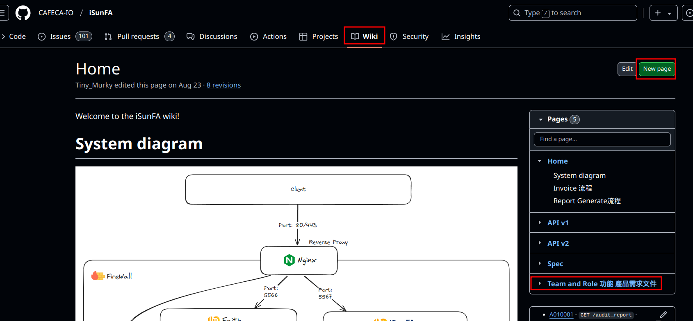
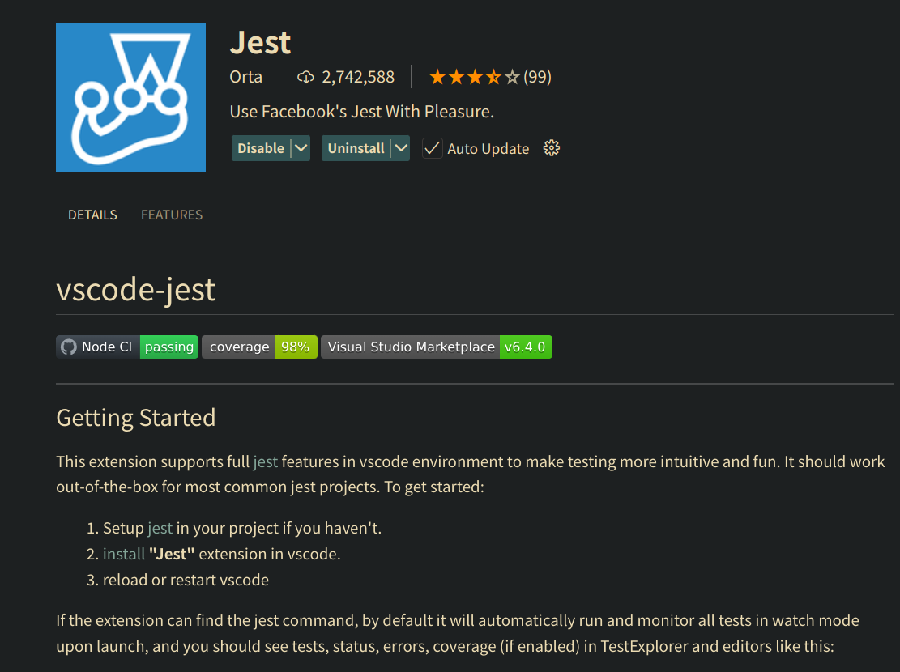
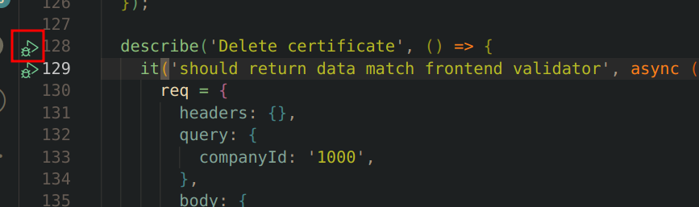
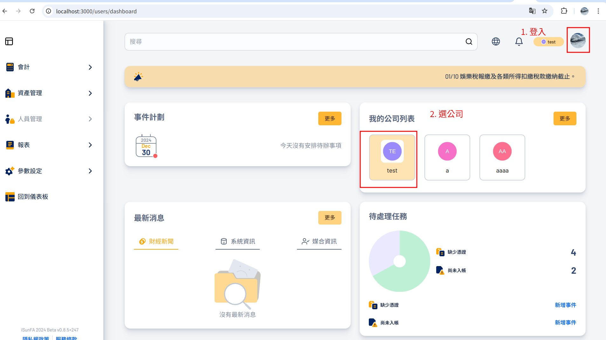
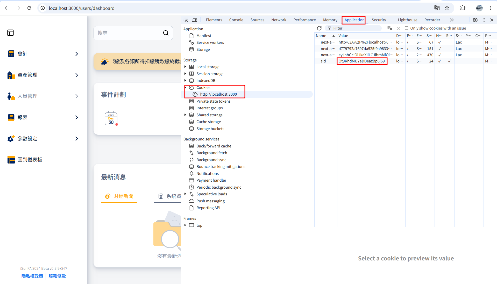
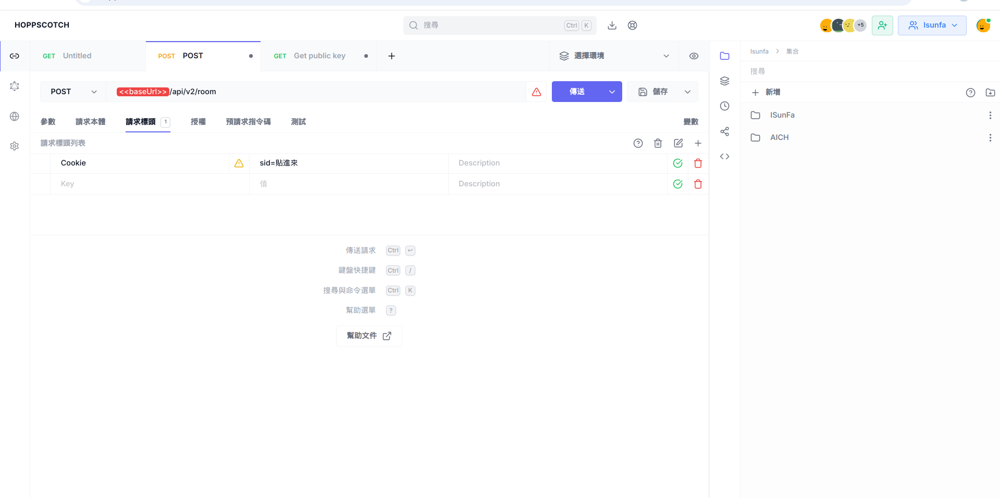

# 0. 前言

Hello 我是Murky! 恭喜您加入ISunFa後端Team! 接下來我會為您介紹ISunFa的後端開發流程。
# 1. 前置作業

## 1.1 與設計師討論流程
在新功能開始設計的時候，要開發的需求會先提供給設計師端，並由設計師繪製 Wire frame 與 Mock Up，高度建議於這個階段後端參加或旁聽設計師的討論會議，這樣可以掌握新設計的邏輯與流程。

## 1.2 撰寫User Story
與設計師討論完流程之後可以開始寫 User Story，User Story 可以讓前、後端對新功能有共同的認識，並且可以讓設計師確認開發的功能沒有偏離設計的功能。

> [!note]
> User Story 可以參照：
> - 身為一個 `某種身分的使用者`
> - 我希望 `某個使用者想要做的事`
> - 所以我需要 `某個功能`

寫完 User Story 之後可以在 [ISunFa Wiki](https://github.com/CAFECA-IO/iSunFA/wiki/) (或是你正在執行的專案的wiki)新增一個`Page`之後貼在裡面。

接者將User Story 和 設計師再過一次，確認User Story沒有偏離設計初衷。



## 1.3 和前端過一次User Story

在設計師完成 **Mock Up** 後，建議召開會議，邀請設計師與前端共同檢視 **User Story**，確保設計師、前端與後端對於開發需求有一致的理解。具體流程如下：

1. **設計師與前端講解 Mock Up**  
    由設計師和前端共同說明 Mock Up 的主要功能，解釋設計細節及交互邏輯，確保各方對設計有清楚的認識。
2. **後端逐條介紹 User Story**  
    後端人員逐條說明 **User Story** 的內容。
3. **設計師與前端提供意見**  
    請設計師和前端根據 Mock Up 和 **User Story** 提出建議，進行修正或補充，以確保需求的完整性與可行性。

透過此流程，確保設計師、前端與後端對於開發目標及執行細節有共同理解，減少後續開發中的溝通成本及需求偏差。

## 1.4 根據 User Story 和 Mock Up 設計 API

> **提示**：1.4 和 1.5 的執行順序可以先與前端討論，因為前端可能會希望先規劃 Component。

在獲得 **User Story** 和 **Mock Up** 畫面後，可以根據這些文件設計所需的 API。對於常見的資源存取，可以採用基於 CRUD 的設計模式，通常包含以下五種 API：

- **List**：取得資源列表
- **Get one**：取得單一資源
- **Create**：創建新資源
- **Update**：更新資源
- **Delete**：標記資源為刪除（注意：`Delete` 並非真的刪除，而是為資源增加 `deletedAt` 的時間戳）

在規劃 API 時，可以（但不強制）參考以下表格進行填寫，目的是確保每個 **User Story** 都能對應到至少一個 API：

|功能名稱|功能描述|User Story 編號|涉及資料表|API|
|---|---|---|---|---|
|這邊使用 Pseudo 名稱即可 (ex: createVoucher)|簡單描述 API 功能 (ex: 創建傳票)|可以放 User Story 編號 (ex: 2.2.3-10)|ex: Voucher, Certificate|`POST /company/:companyId/voucher`|


## 1.5 請前端規劃 Component

> **提示**：建議先完成 **1.4 API 設計**，讓前端參考 API 討論 Component。

在這個階段，可以請前端依據 **1.4 API List** 規劃畫面需求，並召開會議確認以下事項：

1. **畫面需求確認**  
    前端釐清各頁面所需的Component，如果時間充足可以請前端列出Component需要的料 Interface。
2. **API 需求討論**  
    前端根據畫面設計，檢查現有 API 是否足夠，並確認需要新增或修改的 API。
3. **缺漏 API 回饋**  
    如果發現缺少 API，前端需將需求整理後告訴後端，後端將這些資料補充至 **1.4 API List** 中。
    


## 1.6 開會討論 API 的 Request 與 Response Interface

在前端確認 **Component** 之後，可以召開會議討論各個 API 的串接接口，主要針對以下四個項目進行決定：

|項目|說明|
|---|---|
|**Param**|URL 路徑參數，例如 `:companyId`，在 Next.js 中為 `[companyId]`，後端則透過 `req.query` 獲取。|
|**Query**|URL 查詢參數，例如 `?query1=xxx`，後端用 `req.query` 獲取。需要注意，後端接收到的值類型都是 `string`。|
|**Body**|在 `POST` 或 `PUT` 請求中，前端提供的數據由後端通過 `req.body` 獲取，類型為 `any`。|
|**Response JSON**|後端回傳的 JSON 格式。|

---

### 接口規範與實作

1. **定義 Response JSON 的 Interface**  
    討論完成後，應將 `Response JSON` 的接口建立在 `src/interface` 資料夾中。如果沒有相關的 TypeScript 文件，則自行創建。
    
2. **更佳實作方式**  
    若需要提高接口定義的一致性，可以先撰寫 **Zod Schema** 並使用以下方法確保與 TypeScript 接口一致：
    
    ```typescript
    type ISchema = z.infer<typeof schema>;
    ```
    
    （目前尚未採用此實作方式，但可作為未來改進方案。）
    

---

透過這樣的討論流程，可以確保前後端在 API 設計上的溝通清楚，減少串接問題，提高開發效率與可維護性。

## 1.7 設計Database

> [!note]
> - [ER model xml](https://github.com/CAFECA-IO/Documents/blob/main/ISF/xml/ISF_ER_Model.xml)

如果新功能需要更改Database的話，可以先畫ER model, 先從上方連結下載 `xml`檔案，然後用 `drop.io`  打開，更改完之後存檔，再把存好的xml覆蓋原本的xml。

## 1.8 Sequence Diagram

> [!note]
> - [sequencediagram.org](https://sequencediagram.org/)

如果遇到很複雜的流程(像是與 `AI`, `Pusher` 有關的邏輯)，可以先畫Sequence Diagram，沒有限定工具，但可以用上方提供的 [sequencediagram.org](https://sequencediagram.org/)畫。

設計內容主要是 前、後端與第三台機器 (ex: `Ollama`, `Pusher`, `第三方API`)。完成後可以把檔案貼在 `WIKI`上面，讓前、後端參考。

# 2 Mock API


這一步驟的目的是先撰寫假的 API，提供假資料讓前端能夠進行畫面開發。步驟如下：

1. 撰寫 **Zod Schema**。
2. 新增 `APIName`、`IAPIName`、`APIPath`、`APIConfig`、`AUTH_CHECK`、`AUTH_WHITELIST`。
3. 撰寫 Mock API。
4. 撰寫 **API Integration Test**。
5. 使用 **Hoppscotch** 測試。

## 2.1 Zod Schema
在 `src/lib/utils/zod_schema` 資料夾中，根據需要新增一個檔案（或使用已存在的檔案），並撰寫以下類似的 Schema：

#### Schema 結構

1. **Query Schema**  
    用於檢查 Query 和 Path Parameter 的格式。因為 Next.js 將這兩者都放在 `req.query`，因此需要同時驗證。
2. **Body Schema**  
    用於檢查 `req.body` 的格式：
    - 一般情況：使用 `z.object()` 檢查。
    - 如果是 `GET` 請求：使用 `z.union([z.object({}), z.string()])` 跳過檢查，或直接使用 `z.any()`。
3. **Output Schema**  
    用於驗證後端回傳的 JSON 格式：
    - 當後端返回 `payload` 時，`payload` 會先通過此 Schema。
    - 可以使用 `.transform()` 方法，在最後一步調整回傳的型態。
4. **Frontend**  
    預留給前端使用，用於轉換後端回傳的 JSON（目前尚未實作，但可以填寫前端預期的 Interface，供整合測試時使用）。
    
```ts
export const voucherDeleteSchema = {
  input: {
    querySchema: z.object(),
    bodySchema:  z.union([z.object({}), z.string()]);,
  },
  outputSchema: z.union([z.number(), z.null()]),
  frontend: z.number(),
};
```

## 2.2 新增 `APIName`、`IAPIName`、`APIPath`、`APIConfig`、`AUTH_CHECK`、`AUTH_WHITELIST`。

- 前往 `src/constants/api_connection.ts`，在 `APIName` 依照API 的功能取一個新的API名稱
- 並在相同檔案(`src/constants/api_connection.ts`) ，`APIPath` 中依照 `APIName` 設定 api url (Nextjs 是依照資料夾結構決定API, Api 放在 `src/pages/api`，但是url會是 `localhost:3000/api/...`，不包含`page`)
- 前往`src/interfaces/api_connection.ts`的 `IAPIName`，把 `APIName`新增的名稱複製在裡面。
- 回到 `src/constants/api_connection.ts`，在 `APIConfig` 中貼上類似下面格式，用來mapping `APIName`和 `APIPath`，以及前端需要用什麼`method`使用api
```ts
  [APIName.AGREE_TO_TERMS]: createConfig({
    name: APIName.AGREE_TO_TERMS,
    method: HttpMethod.POST,
    path: APIPath.AGREE_TO_TERMS,
  }),
```
- 前往`src/constants/auth.ts`，在 `AUTH_CHECK` 加上類似下面這樣，(`AuthFunctionsKeysNew`都填寫`user`就可以了)。
```ts
[APIName.LIST_USER_COMPANY]: [AuthFunctionsKeysNew.user],
```
- 如果不想要有權限阻擋，可以在`src/constants/auth.ts`把API加在 `AUTH_WHITELIST`，這樣就不會觸發 `session`檢查。

## 2.3 撰寫 Mock

在 `src/page/api/v2`向下新增api，api 是依照folder的路徑，可以參考 [Page API Routes](https://nextjs.org/docs/pages/building-your-application/routing/api-routes)。
假設今天是 `src/pages/api/v2/company/[companyId]/voucher/[voucherId]/index.ts`，路徑會是 `localhost:3000/api/v2/company/:companyId/voucher/:voucherId` (`index.ts`這個檔名會特別被跳過不在 api path)。

以下是一個 `PUT voucher`的例子：
- 首先是 `handlePutRequest`：
	- 先指定 type 是 `IHandleRequest<APIName.你的api, 要傳給 outputSchema的東西>`
	- 並在 input 放上 `{query, body, session}`
		- session可以拿到 userId和companyId
		- query可以拿到在 querySchema裡面放的東西
		- body可以拿到在bodySchema裡面的東西
	- 在function裡面時先 設定 `statusMessage`是 `BadRequest`, `payload`是 `null`，要特別注意coding style 規定不要 early return, 所以這邊是用 `flag`的寫法。
	- 這邊假設Put 修正完就只回傳 被修正的`voucherId`，在`try catch`中將payload設定成`1` 。
	- 最後 return `statusMessage`和`payload`
- 接著設定 `APIResponse` , 這個是前端應該要接到的type, 不是要傳給outputSchema的值，而是經過outputSchema後吐出來的值
- 接著設定下面這個特殊的mapping，這裡的 `withRequestValidation`是Middleware的替代品，可以進去看看權限檢查邏輯
- 最後的　`export default async function handler`不需要特別去動他，這樣就完成 `POST`邏輯
```ts

const methodHandlers: {
  [key: string]: (
    req: NextApiRequest,
    res: NextApiResponse
  ) => Promise<{
    statusMessage: string;
    payload: APIResponse;
  }>;
} = {
  PUT: (req, res) => withRequestValidation(APIName.VOUCHER_PUT_V2, req, res, handlePutRequest),
};
```

```ts

export const handlePutRequest: IHandleRequest<APIName.VOUCHER_PUT_V2, number> = async ({ // 這邊的number是這個funtion回傳給api的東西
  query,
  body,
  session,
}) => {
  let statusMessage: string = STATUS_MESSAGE.BAD_REQUEST;
  let payload: number | null = null;
  
  const { userId, companyId } = session; // session可以拿到 userId和companyId
  const { voucherId } = query; // 在 querySchema裡面放什麼，這邊就可以拿到什麼值
  const { voucherDate } = body; // 在 bodySchema裡面放什麼，這邊就可以拿到什麼值

  try{
    const mockVoucherId = 1;
    statusMessage = STATUS_MESSAGE.SUCCESS_UPDATE;
    payload =  mockVoucherId;
  } catch (_error) {
    const error = _error as Error;
    loggerError({
      userId,
      errorType: 'Voucher Put handlePutRequest',
      errorMessage: error.message,
    });
  }

  return {
    statusMessage,
    payload,
  };
};

type APIResponse = number | null; // 這個是前端應該要接到的type, 不是要傳給outputSchema的值，而是經過outputSchema後吐出來的值

const methodHandlers: {
  [key: string]: (
    req: NextApiRequest,
    res: NextApiResponse
  ) => Promise<{
    statusMessage: string;
    payload: APIResponse;
  }>;
} = {
  PUT: (req, res) => withRequestValidation(APIName.VOUCHER_PUT_V2, req, res, handlePutRequest),
};


export default async function handler(
  req: NextApiRequest,
  res: NextApiResponse<IResponseData<APIResponse>>
) {
  let statusMessage: string = STATUS_MESSAGE.BAD_REQUEST;
  let payload: APIResponse = null;
  const userId: number = -1;

  try {
    const handleRequest = methodHandlers[req.method || ''];
    if (handleRequest) {
      ({ statusMessage, payload } = await handleRequest(req, res));
    } else {
      statusMessage = STATUS_MESSAGE.METHOD_NOT_ALLOWED;
    }
  } catch (_error) {
    const error = _error as Error;
    loggerError({
      userId,
      errorType: error.name,
      errorMessage: error.message,
    });
    statusMessage = error.message;
  }
  const { httpCode, result } = formatApiResponse<APIResponse>(statusMessage, payload);
  res.status(httpCode).json(result);
}
```

## 2.4 撰寫 **API Integration Test**
> [!note]
> - 如果是用VS Code可以先下載 `jest`套件



測試步驟不是必要，但是因為API都有權限阻擋，測試api會需要把整個專案 Build起來。因此用整合測試的方法直接看結果會比較快一點，以下是 `PUT localhost:3000/api/v2/company/:companyId/voucher/:voucherId
的範例測試，可以直接複製修改。


```ts
import { NextApiRequest, NextApiResponse } from 'next';
import handler from '@/pages/api/v2/company/[companyId]/voucher/[voucherId]/index'; // 這個是要測試的api handler
import prisma from '@/client'; // prisma 是 orm，這邊主要是要 mock userActionLog
import { UserActionLogActionType } from '@/constants/user_action_log'; // 這個也是要 mock userActionLog
import { voucherGetOneSchema } from '@/lib/utils/zod_schema/voucher';


// 要特別注意這裡的 `..`，要從這個測試的位置一直 `..`到 /src
// 這裡mock get session來跳過權限判斷，並設定session的
jest.mock('../../../../../../../lib/utils/session.ts', () => ({
  getSession: jest.fn().mockResolvedValue({
    userId: 1001,
    companyId: 1001,
    roleId: 1001,
    cookie: {
      httpOnly: false,
      path: 'string',
      secure: false,
    },
  }),
}));

// mock auth_check, 保證通過權限測試
jest.mock('../../../../../../../lib/utils/auth_check', () => ({
  checkAuthorization: jest.fn().mockResolvedValue(true),
}));


// 跳過紀錄userActionLog
beforeEach(() => {
  jest.spyOn(prisma.userActionLog, 'create').mockResolvedValue({
    id: 1,
    sessionId: '1',
    userId: 1001,
    actionType: UserActionLogActionType.API,
    actionDescription: 'null',
    actionTime: Date.now(),
    ipAddress: '127.0.0.1',
    userAgent: 'null',
    apiEndpoint: 'null',
    httpMethod: 'GET',
    requestPayload: {},
    httpStatusCode: 200,
    statusMessage: 'null',
    createdAt: 1,
    updatedAt: 1,
    deletedAt: null,
  });
});

// 清掉所有mock
afterEach(() => {
  jest.clearAllMocks();
});

describe('company/[companyId]/voucher/voucherId integration test', () => {
  let req: jest.Mocked<NextApiRequest>;
  let res: jest.Mocked<NextApiResponse>;
  describe('Put one voucher', () => {
    it('should return data match frontend validator', async () => {
      req = {
        headers: {},
        query: { // query和parameter需要什麼值，可以mock在這裡
          voucherId: '1002',
        },
        method: 'PUT', // 要特別寫想要策的方法
        json: jest.fn(),
        body: { // body需要什麼值可以放在這裡
          actions: [],
          certificateIds: [1001],
          voucherDate: 1,
          type: 'payment',
          note: '',
          lineItems: [
            {
              // Info: (20241118 - Murky) id: 1000
              description: '償還應付帳款-銀行現金',
              amount: 100,
              debit: false,
              accountId: 10000603,
            },
            {
              // Info: (20241118 - Murky) id: 1001
              description: '償還應付帳款-應付帳款',
              amount: 100,
              debit: true,
              accountId: 10000981,
            },
          ],
          assetIds: [2],
          counterPartyId: 1001,
          reverseVouchers: [
            {
              voucherId: 1001,
              lineItemIdBeReversed: 1000,
              lineItemIdReverseOther: 1,
              amount: 100,
            },
          ], 
        },
      } as unknown as jest.Mocked<NextApiRequest>;

      res = {
        status: jest.fn().mockReturnThis(),
        json: jest.fn(),
      } as unknown as jest.Mocked<NextApiResponse>;

      const outputValidator = voucherPutSchema.frontend; // 這邊可以用 frontend schema來測試是不是前端想要的datatype，用safeParse檢查
      await handler(req, res);
      const apiResponse = res.json.mock.calls[0][0]; // 如果成功的話 apiResponse會是 透過 `outputSchema`回傳的值，可以console.log(apiResponse) 看看回傳什麼
      
      const { success } = outputValidator.safeParse(apiResponse.payload); // 後端回傳的json 會放在 `{payload: xxx}` 裡面
      expect(success).toBe(true); // true就是通過
      expect(apiResponse.payload).toBe(1002);
    });
  });
});
```

如果有下載 `Jest`套件，可以直接按測試圖案來單獨跑測試



## 2.5 使用 **Hoppscotch** 測試

> [!note]
> - [Hoppscotch.io](https://hoppscotch.io/)

Hoppscotch 是 開源版本的 Postman，目前有一個前後端一起用的 team可以加入，用法和Postman差不多，可以把 Query, Parameter 和 body的範例寫好之後，儲存`回傳結果`方便前端串接。

最重要的是繞果權限檢查的方法，首先先把專案Build起來，接下來進入 `localhost:3000`之後登入並選擇一個公司。



按下 F12 進到 `Application`, 點選 `cookie`, `localhost:3000`, 複製 `sid`的值



在 Hoppscotch，點選請求標頭 (`header`)，加入 `Cookie`欄位，值填寫 `sid=剛剛複製的值`，就可以正常操作了。



